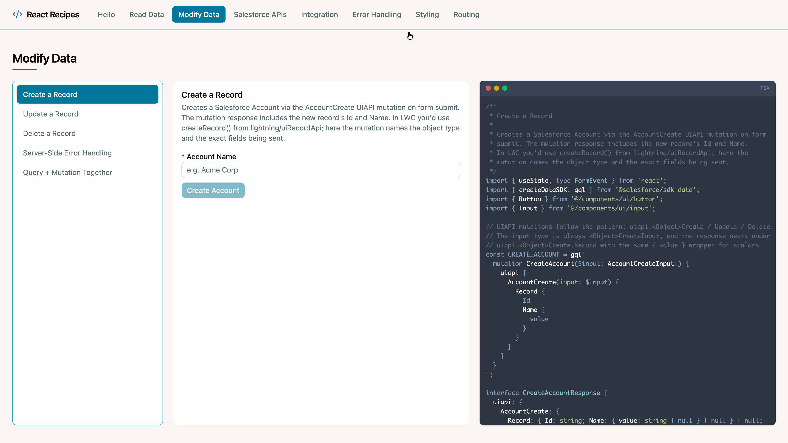
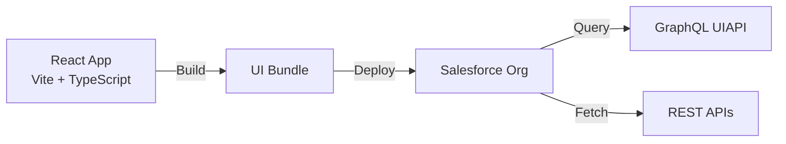

# Multiframework Recipes

[](https://github.com/trailheadapps/multiframework-recipes/actions/workflows/ci.yml)
[](https://codecov.io/gh/trailheadapps/multiframework-recipes)



A collection of easy-to-digest code examples for building apps on the Salesforce platform using modern frontend frameworks. Each recipe demonstrates how to accomplish a specific task — from querying data with GraphQL to handling errors and navigating between views — in the fewest lines of code possible while following best practices. Each recipe includes an inline source code viewer so you can see exactly how it works.

This sample application is designed to run on the Salesforce Platform. It covers what a frontend developer needs to know about Salesforce, and what a Salesforce developer needs to know about modern frameworks — taught at the intersection.

> Multi-Framework currently supports **React**, with additional frameworks coming over time. The feature is in Beta and only available in Scratch Orgs and Sandboxes — not yet in Developer Edition orgs or Trailhead Playgrounds.
>
> There is a known limitation where orgs that do not use English (`en_US`) as the default language may experience issues. The scratch org definition in this project explicitly sets `"language": "en_US"` to work around this. If you are using a sandbox or other org type, ensure the default language is set to English.

**Learn more:** Read the [Salesforce Multi-Framework developer guide](https://developer.salesforce.com/docs/platform/einstein-for-devs/guide/reactdev-overview.html) for a comprehensive overview.

## Architecture



## Table of Contents

- [Setting up a Scratch Org](#setting-up-a-scratch-org)
- [Setting up a Sandbox](#setting-up-a-sandbox)
- [Developer Edition](#developer-edition)
- [Install & Deploy React Recipes](#install--deploy-react-recipes)
- [Local Development](#local-development)
- [Testing](#testing)
- [Optional installation instructions](#optional-installation-instructions)

## Setting up a Scratch Org

1. Set up your environment. Follow the steps in the [Quick Start: Lightning Web Components](https://trailhead.salesforce.com/content/learn/projects/quick-start-lightning-web-components/) Trailhead project. The steps include:
   - Enable Dev Hub in your Trailhead Playground
   - Install Salesforce CLI
   - Install Visual Studio Code
   - Install the Visual Studio Code Salesforce extensions

1. Make sure you have **Node.js v22+** and **npm** installed.

1. Install the ui-bundle-dev plugin:

   ```bash
   sf plugins install @salesforce/plugin-ui-bundle-dev
   ```

1. If you haven't already done so, authorize your hub org and provide it with an alias (**myhuborg** in the command below):

   ```bash
   sf org login web -d -a myhuborg
   ```

1. Clone this repository:

   ```bash
   git clone https://github.com/trailheadapps/multiframework-recipes
   cd multiframework-recipes
   ```

1. Create a scratch org and provide it with an alias (**recipes** in the command below):

   ```bash
   sf org create scratch -d -f config/project-scratch-def.json -a recipes
   ```

1. Deploy shared metadata:

   ```bash
   sf project deploy start -d force-app/main/default/objects -d force-app/main/default/classes -d force-app/main/default/permissionsets -d force-app/main/default/cspTrustedSites
   ```

1. Assign the **recipes** permission set to the default user:

   ```bash
   sf org assign permset -n recipes
   ```

1. Import sample data:

   ```bash
   sf data tree import -p ./data/data-plan.json
   ```

## Setting up a Sandbox

1. Set up your environment. Follow the steps in the [Quick Start: Lightning Web Components](https://trailhead.salesforce.com/content/learn/projects/quick-start-lightning-web-components/) Trailhead project. The steps include:
   - Install Salesforce CLI
   - Install Visual Studio Code
   - Install the Visual Studio Code Salesforce extensions

1. Make sure you have **Node.js v22+** and **npm** installed.

1. Install the ui-bundle-dev plugin:

   ```bash
   sf plugins install @salesforce/plugin-ui-bundle-dev
   ```

1. Authorize your sandbox org and provide it with an alias (**mysandbox** in the command below):

   ```bash
   sf org login web -a mysandbox
   ```

1. Clone this repository:

   ```bash
   git clone https://github.com/trailheadapps/multiframework-recipes
   cd multiframework-recipes
   ```

1. Deploy shared metadata:

   ```bash
   sf project deploy start -d force-app/main/default/objects -d force-app/main/default/classes -d force-app/main/default/permissionsets -d force-app/main/default/cspTrustedSites
   ```

1. Assign the **recipes** permission set to the default user:

   ```bash
   sf org assign permset -n recipes
   ```

1. Import sample data:

   ```bash
   sf data tree import -p ./data/data-plan.json
   ```

## Developer Edition

Developer Edition support is coming soon.

## Install & Deploy React Recipes

1. Install dependencies, fetch the GraphQL schema, and run codegen:

   ```bash
   cd force-app/main/react-recipes/uiBundles/reactRecipes
   npm install
   npm run graphql:schema
   npm run graphql:codegen
   ```

1. Build the app:

   ```bash
   npm run build
   ```

1. Deploy the UI bundle to your org:

   ```bash
   cd ../../../../..
   sf project deploy start --source-dir force-app/main/react-recipes/uiBundles/reactRecipes
   ```

1. Open the scratch org and select the **React Recipes** app in App Launcher:

   ```bash
   sf org open
   ```

## Local Development

Start the Vite development server with hot module replacement:

```bash
npm run dev
```

Build the app for production:

```bash
npm run build
```

Preview the production build locally:

```bash
npm run preview
```

## Testing

Run unit tests ([Vitest](https://vitest.dev/) + [React Testing Library](https://testing-library.com/docs/react-testing-library/intro/)):

```bash
npm test
```

Run with coverage:

```bash
npm run test:coverage
```

Run end-to-end tests ([Playwright](https://playwright.dev/)):

```bash
npx playwright install chromium
npm run build:e2e
npm run test:e2e
```

## Optional Installation Instructions

This repository contains several files that are relevant if you want to integrate modern web development tools into your Salesforce development processes or into your continuous integration/continuous deployment processes.

### Code formatting

[Prettier](https://prettier.io/) is a code formatter used to ensure consistent formatting across your code base. To use Prettier with Visual Studio Code, install [this extension](https://marketplace.visualstudio.com/items?itemName=esbenp.prettier-vscode) from the Visual Studio Code Marketplace. The [.prettierignore](/.prettierignore) and [.prettierrc](/.prettierrc) files are provided as part of this repository to control the behavior of the Prettier formatter.

### Code linting

[ESLint](https://eslint.org/) is a popular JavaScript linting tool used to identify stylistic errors and erroneous constructs. The apps use ESLint with TypeScript and framework-specific plugins.

### Pre-commit hook

This repository comes with a [package.json](./package.json) file that makes it easy to set up a pre-commit hook that enforces code formatting and linting by running Prettier and ESLint every time you `git commit` changes.

To set up the formatting and linting pre-commit hook:

1. Install [Node.js](https://nodejs.org) if you haven't already done so.
1. Run `npm install` in your project's root folder to install the ESLint and Prettier modules.

Prettier and ESLint will now run automatically every time you commit changes. The commit will fail if linting errors are detected. You can also run the formatting and linting from the command line using the following commands (check out [package.json](./package.json) for the full list):

```bash
npm run lint
```
