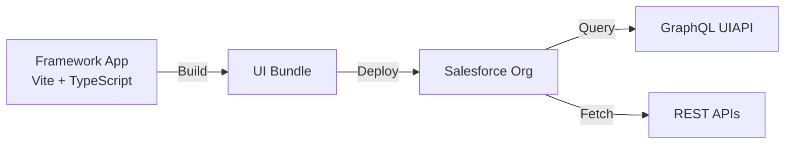
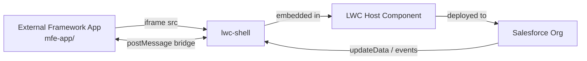

# Multi-Framework Recipes

[](https://github.com/trailheadapps/multiframework-recipes/actions/workflows/ci.yml)
[](https://codecov.io/gh/trailheadapps/multiframework-recipes)


A collection of easy-to-digest code examples for building Salesforce apps with modern frontend frameworks. Every recipe teaches one concept — querying data with GraphQL, handling errors, navigating between views, embedding an external app — in the fewest lines of code possible while following best practices. Each recipe includes an inline source code viewer so you can see exactly how it works.

The repo covers both axes a modern Salesforce frontend developer needs to navigate:

- **Framework:** React today, with Vue and Angular planned. Same recipes, different implementations.
- **Hosting mode:** Whether you run the app on your own infrastructure or ship it to the Salesforce platform.

> **Status:** React is the only framework implemented today. Vue and Angular are planned. Multi-Framework is in Beta and available in Scratch Orgs and Sandboxes — not yet in Developer Edition orgs or Trailhead Playgrounds.
>
> **Known limitation:** orgs that do not use English (`en_US`) as the default language may experience issues. The scratch org definition in this project explicitly sets `"language": "en_US"` to work around this. On sandbox or other org types, ensure the default language is English.

**Learn more:** Read the [Salesforce Multi-Framework developer guide](https://developer.salesforce.com/docs/platform/einstein-for-devs/guide/reactdev-overview.html) for a comprehensive overview.

## The Two Hosting Modes

Every recipe in this repo falls into one of two hosting modes. The framework code is similar; the deployment, distribution, and integration story is very different.

### Salesforce-Hosted

The framework app is built as a **Salesforce UI Bundle** and deployed directly to the org. Salesforce serves the static assets from the platform; no external hosting required.



**Use when:** you want a single-team workflow, zero external infrastructure, and deep integration with Salesforce's security/identity model.

Today this mode lives in [`force-app/main/react-recipes/uiBundles/reactRecipes/`](force-app/main/react-recipes/uiBundles/reactRecipes/).

### Externally Hosted

The framework app runs on your own infrastructure (Vercel, AWS, anywhere) and is embedded into a Salesforce Lightning page via `lwc-shell`. A postMessage bridge proxies data, events, and GraphQL between the two sides.



**Use when:** you already have an externally hosted app, need your own build/release cadence, or want to reuse the same app across Salesforce and non-Salesforce surfaces.

Today this mode lives in [`mfe-app/`](mfe-app/) (the external React app) plus [`force-app/main/default/lwc/mfe*`](force-app/main/default/lwc/) (the LWC host components).

### How the framework app talks to Salesforce

The two hosting modes use different APIs because they run in different security contexts:

- **Salesforce-hosted** recipes call native Lightning modules directly — `lightning/uiRecordApi`, `lightning/navigation`, `lightning/graphql`, `@salesforce/apex` — same as any LWC.
- **Externally hosted** recipes use the postMessage bridge ([`@salesforce/experimental-mfe-bridge`](https://www.npmjs.com/package/@salesforce/experimental-mfe-bridge)) to talk to the host LWC, which then calls Lightning modules on the MFE's behalf. The bridge surface (`bridge.isConnected()`, `bridge.dispatchEvent()`, `bridge.addEventListener('data', …)`, etc.) is the contract between the embedded app and the host shell.

## Table of Contents

- [Setting up a Scratch Org](#setting-up-a-scratch-org)
- [Setting up a Sandbox](#setting-up-a-sandbox)
- [Developer Edition](#developer-edition)
- [Install & Deploy Salesforce-Hosted Recipes](#install--deploy-salesforce-hosted-recipes)
- [Install & Run Externally Hosted Recipes](#install--run-externally-hosted-recipes)
- [Local Development](#local-development)
- [Testing](#testing)
- [Optional installation instructions](#optional-installation-instructions)

## Setting up a Scratch Org

1. Set up your environment. Follow the steps in the [Quick Start: Lightning Web Components](https://trailhead.salesforce.com/content/learn/projects/quick-start-lightning-web-components/) Trailhead project. The steps include:
   - Enable Dev Hub in your Trailhead Playground
   - Install Salesforce CLI
   - Install Visual Studio Code
   - Install the Visual Studio Code Salesforce extensions

1. Make sure you have **Node.js v22+** and **npm** installed.

1. Make sure you have **Salesforce CLI v2.130.7+** installed. This version includes the UI Bundle plugin. Check your version with `sf --version` and update with `sf update` if needed.

1. If you haven't already done so, authorize your hub org and provide it with an alias (**myhuborg** in the command below):

   ```bash
   sf org login web -d -a myhuborg
   ```

1. Clone this repository:

   ```bash
   git clone https://github.com/trailheadapps/multiframework-recipes
   cd multiframework-recipes
   ```

1. Create a scratch org and provide it with an alias (**recipes** in the command below):

   ```bash
   sf org create scratch -d -f config/project-scratch-def.json -a recipes
   ```

1. Install dependencies and build React Recipes:

   ```bash
   cd force-app/main/react-recipes/uiBundles/reactRecipes
   npm install
   npm run build
   cd ../../../../..
   ```

1. Deploy metadata and the UI bundle:

   ```bash
   sf project deploy start
   ```

1. Assign the **recipes** permission set to the default user:

   ```bash
   sf org assign permset -n recipes
   ```

1. Fetch the GraphQL schema and run codegen:

   ```bash
   cd force-app/main/react-recipes/uiBundles/reactRecipes
   npm run graphql:schema
   npm run graphql:codegen
   cd ../../../../..
   ```

1. Import sample data:

   ```bash
   sf data tree import -p ./data/data-plan.json
   ```

1. Open the org and select the **React Recipes** app in App Launcher:

   ```bash
   sf org open
   ```

## Setting up a Developer Edition Org

1. Set up your environment. Follow the steps in the [Quick Start: Lightning Web Components](https://trailhead.salesforce.com/content/learn/projects/quick-start-lightning-web-components/) Trailhead project. The steps include:
   - Install Salesforce CLI
   - Install Visual Studio Code
   - Install the Visual Studio Code Salesforce extensions

1. Make sure you have **Node.js v22+** and **npm** installed.

1. Make sure you have **Salesforce CLI v2.130.7+** installed. This version includes the UI Bundle plugin. Check your version with `sf --version` and update with `sf update` if needed.

1. Authorize your Developer Edition org and provide it with an alias (**mydevorg** in the command below):

   ```bash
   sf org login web -a mydevorg
   ```

1. Clone this repository:

   ```bash
   git clone https://github.com/trailheadapps/multiframework-recipes
   cd multiframework-recipes
   ```

1. Install dependencies and build React Recipes:

   ```bash
   cd force-app/main/react-recipes/uiBundles/reactRecipes
   npm install
   npm run build
   cd ../../../../..
   ```

1. Deploy metadata and the UI bundle:

   ```bash
   sf project deploy start
   ```

1. Assign the **recipes** permission set to the default user:

   ```bash
   sf org assign permset -n recipes
   ```

1. Fetch the GraphQL schema and run codegen:

   ```bash
   cd force-app/main/react-recipes/uiBundles/reactRecipes
   npm run graphql:schema
   npm run graphql:codegen
   cd ../../../../..
   ```

1. Import sample data:

   ```bash
   sf data tree import -p ./data/data-plan.json
   ```

## Developer Edition

Developer Edition support is coming soon.

## Install & Deploy Salesforce-Hosted Recipes

These recipes run as a Salesforce UI Bundle served directly from the org. Today the only implementation is React; Vue and Angular are planned.

1. Install dependencies, fetch the GraphQL schema, and run codegen:

   ```bash
   cd force-app/main/react-recipes/uiBundles/reactRecipes
   npm install
   npm run graphql:schema
   npm run graphql:codegen
   ```

1. Build the app:

   ```bash
   npm run build
   ```

1. Deploy the UI bundle to your org:

   ```bash
   cd ../../../../..
   sf project deploy start --source-dir force-app/main/react-recipes/uiBundles/reactRecipes
   ```

1. Open the scratch org and select the **React Recipes** app in App Launcher:

   ```bash
   sf org open
   ```

## Install & Run Externally Hosted Recipes

These recipes run an external framework app on your own server and embed it into Salesforce via `lwc-shell`. In development, "externally hosted" means `localhost:4300`; in production you would point the LWC host at your deployed URL. Today the only implementation is React; Vue and Angular are planned.

> **Before you start:** complete the [Scratch Org](#setting-up-a-scratch-org) or [Sandbox](#setting-up-a-sandbox) setup first. Those steps deploy the shared metadata (objects, classes, **CSP Trusted Site for `localhost:4300`**), assign the `recipes` permission set, and import the sample Contact data the recipes display. Without them the iframe is blocked or shows empty data.

1. Install dependencies for the external app:

   ```bash
   cd mfe-app
   npm install
   ```

1. Start the external app's dev server:

   ```bash
   npm run dev
   ```

   The app starts at `http://localhost:4300`. Keep this running while using the externally hosted recipes in your org.

1. Deploy the LWC host components:

   ```bash
   cd ..
   sf project deploy start --source-dir force-app/main/default/lwc
   ```

   This deploys both the `mfe*` recipe wrappers and `vendorLwcShell`, which registers the `<lwc-shell>` custom element they all rely on. `vendorLwcShell` is a vendored bundle of [`@salesforce/experimental-mfe-lwc-shell`](https://www.npmjs.com/package/@salesforce/experimental-mfe-lwc-shell) — it's checked into the repo, so you don't need to build it yourself. Refresh from npm when a new version ships.

1. Add a host component to a Lightning page:

   ```bash
   sf org open
   ```

   In the org, go to **Setup → Lightning App Builder → New → App Page**, drag a *Custom* component (e.g. `mfeBasicEmbed`, `mfeReceiveData`) from the left panel onto the canvas, then **Save → Activate** and pick the apps where it should appear. Open the page from App Launcher to use the recipe.

### Available externally hosted recipes

| LWC host component | External app route | What it demonstrates |
|---|---|---|
| `mfeBasicEmbed` | `/basic-embed` | Minimum viable embed — bridge connection detection |
| `mfeReceiveData` | `/receive-data` | Host pushes data into guest via `shell.updateData()` |
| `mfeSendEvent` | `/send-event` | Guest dispatches events to host via `bridge.dispatchEvent()` |
| `mfeAutoResize` | `/auto-resize` | iframe height follows guest content via ResizeObserver |
| `mfeThemeTokens` | `/theme-tokens` | Salesforce CSS custom properties synced to guest |
| `mfeDirtyState` | `/dirty-state` | Guest notifies host of unsaved changes |

### Pointing at a deployed external app

For production or sandbox use, deploy the external app to a hosted URL and set the `baseUrl` property on each LWC host component to point at that URL instead of `localhost:4300`.

## Local Development

Start the Vite development server with hot module replacement:

```bash
npm run dev
```

Build the app for production:

```bash
npm run build
```

Preview the production build locally:

```bash
npm run preview
```

## Testing

Run unit tests ([Vitest](https://vitest.dev/) + [React Testing Library](https://testing-library.com/docs/react-testing-library/intro/)):

```bash
npm test
```

Run with coverage:

```bash
npm run test:coverage
```

Run end-to-end tests ([Playwright](https://playwright.dev/)):

```bash
npx playwright install chromium
npm run build:e2e
npm run test:e2e
```

## Optional Installation Instructions

This repository contains several files that are relevant if you want to integrate modern web development tools into your Salesforce development processes or into your continuous integration/continuous deployment processes.

### Code formatting

[Prettier](https://prettier.io/) is a code formatter used to ensure consistent formatting across your code base. To use Prettier with Visual Studio Code, install [this extension](https://marketplace.visualstudio.com/items?itemName=esbenp.prettier-vscode) from the Visual Studio Code Marketplace. The [.prettierignore](/.prettierignore) and [.prettierrc](/.prettierrc) files are provided as part of this repository to control the behavior of the Prettier formatter.

### Code linting

[ESLint](https://eslint.org/) is a popular JavaScript linting tool used to identify stylistic errors and erroneous constructs. The apps use ESLint with TypeScript and framework-specific plugins.

### Pre-commit hook

This repository comes with a [package.json](./package.json) file that makes it easy to set up a pre-commit hook that enforces code formatting and linting by running Prettier and ESLint every time you `git commit` changes.

To set up the formatting and linting pre-commit hook:

1. Install [Node.js](https://nodejs.org) if you haven't already done so.
1. Run `npm install` in your project's root folder to install the ESLint and Prettier modules.

Prettier and ESLint will now run automatically every time you commit changes. The commit will fail if linting errors are detected. You can also run the formatting and linting from the command line using the following commands (check out [package.json](./package.json) for the full list):

```bash
npm run lint
```
