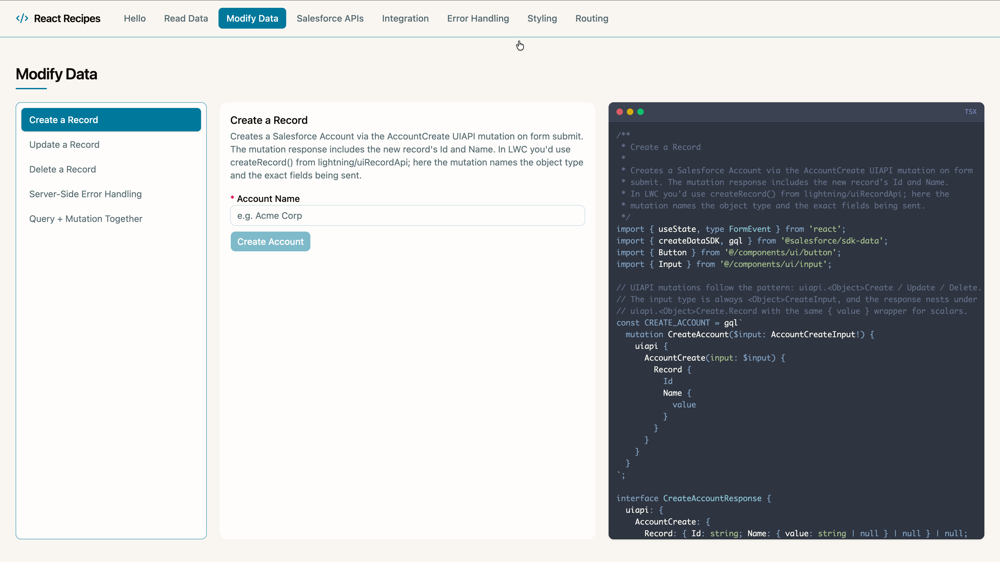

# Multiframework Recipes

[](https://github.com/trailheadapps/multiframework-recipes/actions/workflows/ci.yml)
[](https://codecov.io/gh/trailheadapps/multiframework-recipes)



A collection of easy-to-digest code examples for building apps on the Salesforce platform using modern frontend frameworks. Each recipe teaches one concept in the fewest lines of code possible while following best practices, with an inline source viewer so you can see exactly how it works.

The repo showcases two related platform capabilities, each shipped as its own installable app:

- **Multi-Framework** — build a framework app (React today, more coming) and deploy it to Salesforce as a UI Bundle served directly from the org.
- **Salesforce Microfrontends** — embed an externally hosted app inside a Lightning page via `<lightning-embedding>`, and pass data and events between the two.

Both apps use the same **Platform SDK** to read Salesforce data, dispatch events, and stay in sync with the host — only the transport underneath differs. Learning the SDK is the portable skill this repo teaches.

**Learn more:** Read the [Salesforce Multi-Framework developer guide](https://developer.salesforce.com/docs/platform/multiframework/guide) for a comprehensive overview.

## Prerequisites

- **Node.js v22+** and **npm**
- **Salesforce CLI v2.130.7+** (includes the UI Bundle plugin). Check with `sf --version`; update with `sf update`.
- Visual Studio Code with the [Salesforce Extensions](https://marketplace.visualstudio.com/items?itemName=salesforce.salesforcedx-vscode) (recommended)
- A Dev Hub, or a Sandbox / Developer Edition org (see the [Salesforce Multi-Framework guide](https://developer.salesforce.com/docs/platform/multiframework/guide) for supported org types)

New to Salesforce tooling? Follow the [Quick Start: Lightning Web Components](https://trailhead.salesforce.com/content/learn/projects/quick-start-lightning-web-components/) Trailhead project first.

## Getting Started

Each app README covers setup end-to-end: org creation, deploy, permset, sample data, run. Pick a starting point:

- **[React Recipes](force-app/main/react-recipes/README.md)** — start here if you're new to the repo. Sets up the org, deploys the UI bundle, imports sample data.
- **[Microfrontend Recipes](force-app/main/microfrontend-recipes/README.md)** — additive to React Recipes. Complete that setup first, then this README covers the extra deploy on top.

## Optional Installation Instructions

This repository contains several files that are relevant if you want to integrate modern web development tools into your Salesforce development processes or into your continuous integration/continuous deployment processes.

### Code formatting

[Prettier](https://prettier.io/) is a code formatter used to ensure consistent formatting across your code base. To use Prettier with Visual Studio Code, install [this extension](https://marketplace.visualstudio.com/items?itemName=esbenp.prettier-vscode) from the Visual Studio Code Marketplace. The [.prettierignore](/.prettierignore) and [.prettierrc](/.prettierrc) files are provided as part of this repository to control the behavior of the Prettier formatter.

### Code linting

[ESLint](https://eslint.org/) is a popular JavaScript linting tool used to identify stylistic errors and erroneous constructs. The apps use ESLint with TypeScript and framework-specific plugins.

### Pre-commit hook

This repository comes with a [package.json](./package.json) file that makes it easy to set up a pre-commit hook that enforces code formatting and linting by running Prettier and ESLint every time you `git commit` changes.

To set up the formatting and linting pre-commit hook:

1. Install [Node.js](https://nodejs.org) if you haven't already done so.
1. Run `npm install` in your project's root folder to install the ESLint and Prettier modules.

Prettier and ESLint will now run automatically every time you commit changes. The commit will fail if linting errors are detected. You can also run the formatting and linting from the command line using the following commands (check out [package.json](./package.json) for the full list):

```bash
npm run lint
```
