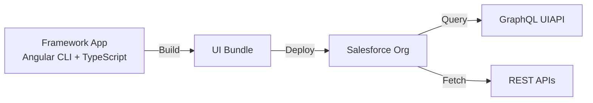

# Angular Recipes

A Salesforce UI Bundle demonstrating how to build an Angular app that runs directly on the Salesforce platform. The bundle is built with the Angular CLI (esbuild) + TypeScript and deployed to the org as a single artifact; Salesforce serves the static assets.



**Use when:** you want a single-team workflow, zero external infrastructure, and deep integration with Salesforce's security/identity model.

> Check the [prerequisites](../../../README.md#prerequisites) in the root README before starting.

## Set Up an Org

Pick one path.

### Scratch org

1. Authorize your Dev Hub (alias **myhuborg**):

   ```bash
   sf org login web -d -a myhuborg
   ```

1. Clone this repository:

   ```bash
   git clone https://github.com/trailheadapps/multiframework-recipes
   cd multiframework-recipes
   ```

1. Create a scratch org (alias **recipes**):

   ```bash
   sf org create scratch -d -f config/project-scratch-def.json -a recipes
   ```

### Sandbox

1. Authorize your Sandbox (alias **mysandbox**):

   ```bash
   sf org login web -a mysandbox -r https://test.salesforce.com
   ```

1. Clone this repository:

   ```bash
   git clone https://github.com/trailheadapps/multiframework-recipes
   cd multiframework-recipes
   ```

### Developer Edition

Developer Edition support is coming soon.

## Install & Deploy

The permission set that grants access to the Angular Recipes app references the UI Bundle metadata, so the app must be deployed to the org before the permset can be assigned.

1. Install dependencies, fetch the GraphQL schema, and run codegen:

   ```bash
   cd force-app/main/angular-recipes/uiBundles/angularRecipes
   npm install
   npm run graphql:schema
   npm run graphql:codegen
   ```

1. Build the app:

   ```bash
   npm run build
   ```

1. Deploy the project to your org:

   ```bash
   cd ../../../../..
   sf project deploy start
   ```

1. Assign the **recipes** permission set to the default user:

   ```bash
   sf org assign permset -n recipes
   ```

1. Import sample data:

   ```bash
   sf data tree import -p ./data/data-plan.json
   ```

1. Open the org and select the **Angular Recipes** app in App Launcher:

   ```bash
   sf org open
   ```

## Local Development

All commands run from `force-app/main/angular-recipes/uiBundles/angularRecipes`.

Start the Angular development server (`sf-angular-serve`) with hot reload:

```bash
npm run dev
```

Build the app for production:

```bash
npm run build
```

## Testing

Run unit tests ([Vitest](https://vitest.dev/) + [Angular TestBed](https://angular.dev/guide/testing)):

```bash
npm test
```

Run end-to-end tests ([Playwright](https://playwright.dev/)):

```bash
npx playwright install chromium
npm run build:e2e
npm run e2e
```
