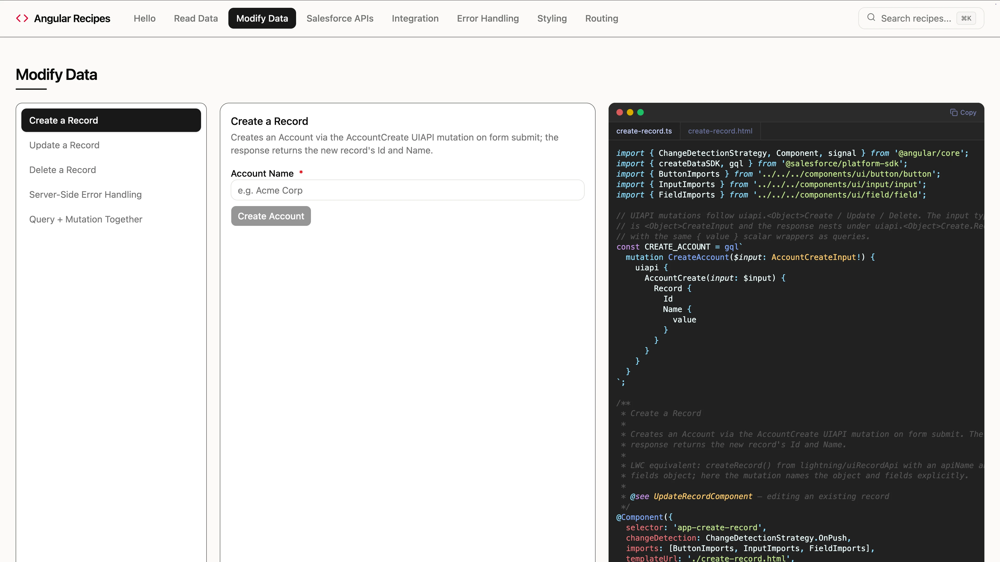

# Angular Recipes



A Salesforce UI Bundle demonstrating how to build an Angular app that runs directly on the Salesforce platform. The bundle is built with the Angular CLI (esbuild) + TypeScript and deployed to the org as a single artifact; Salesforce serves the static assets.

The same bundle also serves the Micro-Frontend **guest** views: chromeless `/embedding/*` routes (plus an `/embedding` catalog, linked as **Micro-Frontends** in the nav) that render outside the app shell and exchange state and events with `<lightning-ui-embedding>` through `@salesforce/platform-sdk`. The LWC hosts that embed them live in [Micro-Frontend Recipes](../microfrontend-recipes).

**Use when:** you want a single-team workflow, zero external infrastructure, and deep integration with Salesforce's security/identity model.

> Check the [prerequisites](../../../README.md#prerequisites) in the root README before starting.

## Install & Deploy

Unless noted, run these commands from the repository root.

1. Install dependencies:

   ```bash
   npm run install:all
   ```

1. Build the app:

   ```bash
   npm run build
   ```

1. Deploy the shared metadata and the Angular UI bundle. This deploys Angular Recipes only — to ship every framework at once, deploy all of `force-app` and assign the `recipesAll` group instead (see the [root README](../../../README.md#setting-up-a-scratch-org)):

   ```bash
   sf project deploy start --source-dir force-app/main/default --source-dir force-app/main/angular-recipes
   ```

1. Assign the permission sets to the default user. `recipes` grants the shared object, field, tab, and Apex access; `angularRecipes` adds the Angular Recipes app:

   ```bash
   sf org assign permset -n recipes
   sf org assign permset -n angularRecipes
   ```

1. Import sample data:

   ```bash
   sf data tree import -p ./data/data-plan.json
   ```

1. Open the org and select the **Angular Recipes** app in App Launcher:

   ```bash
   sf org open
   ```

## Local Development

Start the development server with hot reload:

```bash
npm run dev:angular
```

Build the app for production:

```bash
npm run build
```

## Testing

Run unit tests ([Vitest](https://vitest.dev/) + [Angular TestBed](https://angular.dev/guide/testing)):

```bash
npm run test:angular
```

Run with coverage:

```bash
npm run test:coverage:angular
```

Run end-to-end tests ([Playwright](https://playwright.dev/)):

```bash
cd force-app/main/angular-recipes/uiBundles/angularRecipes
npx playwright install chromium
npm run build:e2e
npm run e2e
```
