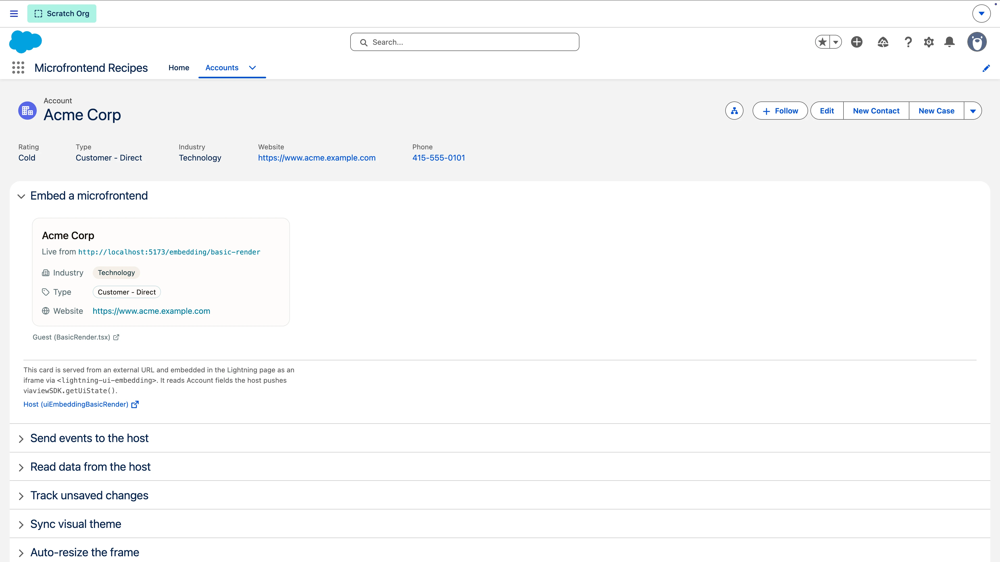
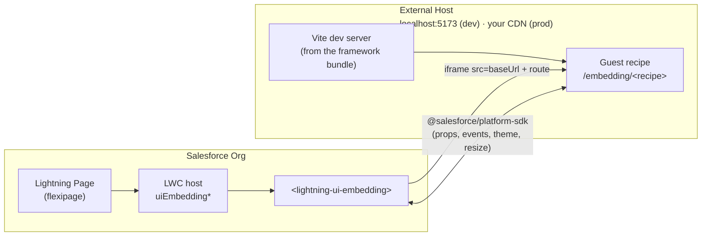

# Micro-Frontend Recipes



Recipes that show how to embed an externally hosted framework app into Salesforce via the standard `<lightning-ui-embedding>` base component. Each recipe is an LWC host component, deployed to the org, that embeds a small guest served by a Vite dev server on an `/embedding/*` route. Most hosts pair with their own guest; the ready- and error-state recipes reuse the Basic Render guest to demonstrate host-side handling.

**Learn more:** Read the [Salesforce Micro-Frontend developer guide](https://developer.salesforce.com/docs/platform/microfrontend/guide/get-started.html) for a comprehensive overview.

## How the pieces fit together



- **LWC host components** (this package, under [`lwc/`](lwc/)) render `<lightning-ui-embedding src="...">` and point at a guest URL built from `baseUrl` + a route.
- **Guest recipes** are written in whichever framework you like. In this repo they come from both the [React](../react-recipes) and [Angular](../angular-recipes) bundles — each under its own `src/**/recipes/embedding/` — and are served on `/embedding/*` routes by a Vite dev server.
- **In development,** "externally hosted" means `http://localhost:5173`.
- **In production,** you deploy the framework app to your own hosting (Vercel, AWS, anywhere) and repoint the hosts. Each `uiEmbedding*` host exposes a **Guest base URL** property (a `targetConfig` on the component), so an admin sets it per placement in the Lightning App Builder — no code change or redeploy. It defaults to `http://localhost:5173` for local development.

**Use when:** you already have an externally hosted app you want to reuse across Salesforce and non-Salesforce surfaces.

> Check the [prerequisites](../../../README.md#prerequisites) in the root README before starting.

## Install & Run

1. Authorize your Dev Hub if you haven't already (alias **myhuborg**):

   ```bash
   sf org login web -d -a myhuborg
   ```

1. Clone this repository:

   ```bash
   git clone https://github.com/trailheadapps/multiframework-recipes
   cd multiframework-recipes
   ```

1. Create a scratch org (alias **recipes**):

   ```bash
   sf org create scratch -d -f config/project-scratch-def.json -a recipes
   ```

1. Install dependencies and build the framework bundle that hosts the guest recipes:

   ```bash
   cd force-app/main/react-recipes/uiBundles/reactRecipes
   npm install
   npm run build
   ```

   The generated GraphQL types are committed, so this builds as-is. Only if you change a query, regenerate them against your org: `npm run graphql:schema && npm run graphql:codegen`.

1. Deploy the shared metadata and the Micro-Frontend host components. This deploys Micro-Frontend Recipes only — to ship every framework at once, deploy all of `force-app` and assign the `recipesAll` group instead (see the [root README](../../../README.md#setting-up-a-scratch-org)):

   ```bash
   cd ../../../../..
   sf project deploy start --source-dir force-app/main/default --source-dir force-app/main/microfrontend-recipes
   ```

1. Assign the **recipes** and **microfrontendRecipes** permission sets to the default user. `recipes` grants the shared object, field, tab, and Apex access; `microfrontendRecipes` adds the Micro-Frontend Recipes app and its tab:

   ```bash
   sf org assign permset -n recipes
   sf org assign permset -n microfrontendRecipes
   ```

   > Both permission sets are required. Micro-Frontend Recipes has no data model of its own — its guests are React and Angular Recipes views — so it deliberately reuses the shared `recipes` permission set for Account access, and `microfrontendRecipes` only layers on the app and tab. Assign just one and the demo loads with no data (or no app).

1. Import sample data:

   ```bash
   sf data tree import -p ./data/data-plan.json
   ```

1. Start the Vite dev server that hosts the guest recipes:

   ```bash
   cd force-app/main/react-recipes/uiBundles/reactRecipes
   npm run dev
   ```

   The server starts at `http://localhost:5173`; the guest recipes are served under `/embedding/*` (for example `http://localhost:5173/embedding/basic-render`). Keep this running while using the app in your org. The CSP trusted site for `localhost:5173` is included in the deployed metadata — no extra CSP step needed. This quick-start uses the React bundle as the guest host; to serve the Angular guests instead, run the Angular dev server (see [Angular Recipes → Local Development](../angular-recipes/README.md#local-development)) — it serves the same `/embedding/*` routes on the same port.

1. In a new terminal, open the org and select the **Micro-Frontend Recipes** app in App Launcher:

   ```bash
   sf org open
   ```

   The app landing page is a banner that jumps to a demo Account. Within this app, Account record pages are overridden with `Microfrontend_Recipes_Account.flexipage` — an accordion of the ten recipes; every other app shows the stock Account page.

## Local Development

Each recipe has two moving parts you iterate on separately.

### Guests (React or Angular)

Guests are served by a framework's Vite dev server on `http://localhost:5173` under `/embedding/<recipe>`, and hot-reload inside the embedded iframe. Either bundle can host them — the LWC hosts embed whichever framework's guest is served on that port, so start the dev server for the framework you want to iterate on:

- **React** — see [React Recipes → Local Development](../react-recipes/README.md#local-development)
- **Angular** — see [Angular Recipes → Local Development](../angular-recipes/README.md#local-development)

Each bundle keeps its guests under `src/recipes/embedding/`.

### Hosts (LWC)

Hosts are deployed to the org. After editing a component under `lwc/`, redeploy it:

```bash
sf project deploy start --source-dir force-app/main/microfrontend-recipes
```

## Testing

### Host components (LWC)

Covered by [sfdx-lwc-jest](https://github.com/salesforce/sfdx-lwc-jest). Run from the repository root:

```bash
npm run test:unit
```

Run with coverage:

```bash
npm run test:unit:coverage
```

### Guest recipes (React or Angular)

Guests are covered by their framework's test suite — see [React Recipes → Testing](../react-recipes/README.md#testing) or [Angular Recipes → Testing](../angular-recipes/README.md#testing).
