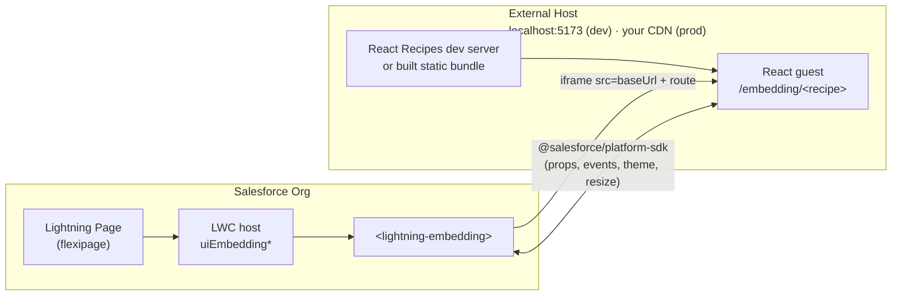

# Microfrontend Recipes

Recipes that show how to embed an externally hosted framework app into Salesforce via the standard `<lightning-embedding>` base component. Each recipe is a pair: an LWC host component deployed to the org, and a small React guest served by the React Recipes dev server on an `/embedding/*` route.

> **Prerequisites:** Set up your org first — see the [root README](../../../README.md#set-up-an-org). The guest recipes live inside the React Recipes bundle, so you'll also work out of `force-app/main/react-recipes/uiBundles/reactRecipes` for the dev server.

## How the pieces fit together



- **LWC host components** (this package, under [`lwc/`](lwc/)) render `<lightning-embedding src="...">` and point at a guest URL built from `baseUrl` + a route.
- **React guests** live under [`../react-recipes/uiBundles/reactRecipes/src/recipes/embedding/`](../react-recipes/uiBundles/reactRecipes/src/recipes/embedding/) and are served on `/embedding/*` routes by the React Recipes dev server.
- **In development,** "externally hosted" means `http://localhost:5173`.
- **In production,** you deploy the React app to your own hosting (Vercel, AWS, anywhere) and point each LWC host's `baseUrl` at that URL.

The CSP trusted site for `localhost:5173` is included in the shared metadata deployed during org setup — no extra CSP step needed.

## Install & Run

1. Start the React Recipes dev server. From the repo root:

   ```bash
   cd force-app/main/react-recipes/uiBundles/reactRecipes
   npm install
   npm run dev
   ```

   The server starts at `http://localhost:5173`; the guest recipes are served under `/embedding/*` (e.g. `http://localhost:5173/embedding/basic-render`). Keep this running while using the app in your org.

1. In a new terminal, deploy this package to your org:

   ```bash
   sf project deploy start -d force-app/main/microfrontend-recipes
   ```

1. Open the org and select the **Microfrontend Recipes** app in App Launcher:

   ```bash
   sf org open
   ```

   The app landing page is a banner that jumps to a demo Account. That Account's record page is overridden — inside this app only — with `Microfrontend_Recipes_Account.flexipage`, an accordion of the six recipes. Every other app sees the stock Account page.
