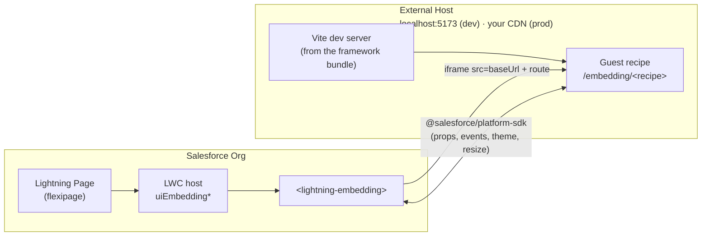

# Microfrontend Recipes

Recipes that show how to embed an externally hosted framework app into Salesforce via the standard `<lightning-embedding>` base component. Each recipe is a pair: an LWC host component deployed to the org, and a small React guest served by a Vite dev server on an `/embedding/*` route.

## How the pieces fit together



- **LWC host components** (this package, under [`lwc/`](lwc/)) render `<lightning-embedding src="...">` and point at a guest URL built from `baseUrl` + a route.
- **Guest recipes** are written in whichever framework you like. In this repo they're React, living under [`../react-recipes/uiBundles/reactRecipes/src/recipes/embedding/`](../react-recipes/uiBundles/reactRecipes/src/recipes/embedding/) and served on `/embedding/*` routes by the Vite dev server.
- **In development,** "externally hosted" means `http://localhost:5173`.
- **In production,** you deploy the framework app to your own hosting (Vercel, AWS, anywhere) and point each LWC host's `baseUrl` at that URL.

**Use when:** you already have an externally hosted app you want to reuse across Salesforce and non-Salesforce surfaces.

> Check the [prerequisites](../../../README.md#prerequisites) in the root README before starting.

## Install & Run

1. Authorize your Dev Hub if you haven't already (alias **myhuborg**):

   ```bash
   sf org login web -d -a myhuborg
   ```

1. Clone this repository:

   ```bash
   git clone https://github.com/trailheadapps/multiframework-recipes
   cd multiframework-recipes
   ```

1. Create a scratch org (alias **recipes**):

   ```bash
   sf org create scratch -d -f config/project-scratch-def.json -a recipes
   ```

1. Install dependencies, fetch the GraphQL schema, and build the framework bundle that hosts the guest recipes:

   ```bash
   cd force-app/main/react-recipes/uiBundles/reactRecipes
   npm install
   npm run graphql:schema
   npm run graphql:codegen
   npm run build
   ```

1. Deploy the project to your org:

   ```bash
   cd ../../../../..
   sf project deploy start
   ```

1. Assign the **recipes** permission set to the default user:

   ```bash
   sf org assign permset -n recipes
   ```

1. Import sample data:

   ```bash
   sf data tree import -p ./data/data-plan.json
   ```

1. Start the Vite dev server that hosts the guest recipes:

   ```bash
   cd force-app/main/react-recipes/uiBundles/reactRecipes
   npm run dev
   ```

   The server starts at `http://localhost:5173`; the guest recipes are served under `/embedding/*` (for example `http://localhost:5173/embedding/basic-render`). Keep this running while using the app in your org. The CSP trusted site for `localhost:5173` is included in the deployed metadata — no extra CSP step needed.

1. In a new terminal, open the org and select the **Microfrontend Recipes** app in App Launcher:

   ```bash
   sf org open
   ```

   The app landing page is a banner that jumps to a demo Account. That Account's record page is overridden — inside this app only — with `Microfrontend_Recipes_Account.flexipage`, an accordion of the six recipes. Every other app sees the stock Account page.
