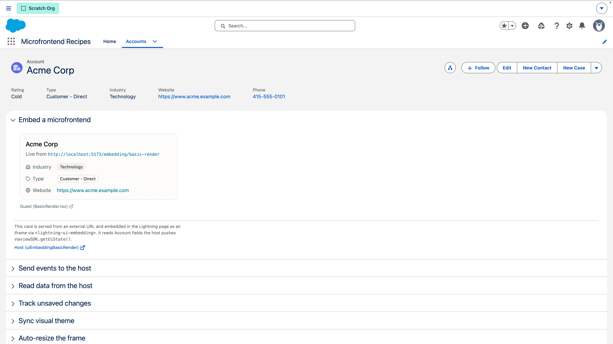
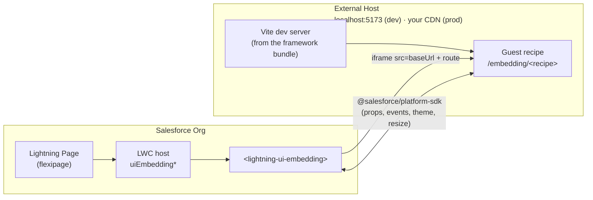

# Micro-Frontend Recipes



Recipes that show how to embed an externally hosted framework app into Salesforce via the standard `<lightning-ui-embedding>` base component. Each recipe is an LWC host component, deployed to the org, that embeds a small guest served by a Vite dev server on an `/embedding/*` route. Most hosts pair with their own guest; the ready- and error-state recipes reuse the Basic Render guest to demonstrate host-side handling.

**Learn more:** Read the [Salesforce Micro-Frontend developer guide](https://developer.salesforce.com/docs/platform/microfrontend/guide/get-started.html) for a comprehensive overview.

## How the pieces fit together


```mermaid
graph LR
    subgraph SF["Salesforce Org"]
        LP["Lightning Page<br/>(flexipage)"]
        LWC["LWC host<br/>uiEmbedding*"]
        LE["&lt;lightning-ui-embedding&gt;"]
        LP --> LWC --> LE
    end
    subgraph EXT["External Host<br/>localhost:5173 (dev) · your CDN (prod)"]
        DEV["Vite dev server<br/>(from the framework bundle)"]
        GUEST["Guest recipe<br/>/embedding/&lt;recipe&gt;"]
        DEV --> GUEST
    end
    LE -->|iframe src=baseUrl + route| GUEST
    GUEST <-->|"@salesforce/platform-sdk<br/>(props, events, theme, resize)"| LE
```

- **LWC host components** (this package, under [`lwc/`](lwc/)) render `<lightning-ui-embedding src="...">` and point at a guest URL built from `baseUrl` + a route.
- **Guest recipes** are written in whichever framework you like. In this repo they come from both the [React](../react-recipes) and [Angular](../angular-recipes) bundles — each under its own `src/**/recipes/embedding/` — and are served on `/embedding/*` routes by a Vite dev server.
- **In development,** "externally hosted" means `http://localhost:5173`.
- **In production,** you deploy the framework app to your own hosting (Vercel, AWS, anywhere) and repoint the hosts. Each `uiEmbedding*` host exposes a **Guest base URL** property (a `targetConfig` on the component), so an admin sets it per placement in the Lightning App Builder — no code change or redeploy. It defaults to `http://localhost:5173` for local development.

**Use when:** you already have an externally hosted app you want to reuse across Salesforce and non-Salesforce surfaces.

> To install and deploy, follow [Setting up a Scratch Org](../../../README.md#setting-up-a-scratch-org) in the root README — it deploys the host components, their Lightning pages, and the CSP trusted site for `localhost:5173` along with every other recipe app.

## Running the guest server

The LWC hosts deploy to the org, but the guests they embed are served from your machine. After deploying, start a guest dev server from the repository root and keep it running while you use the app:

```bash
npm run dev:react
```

The server starts at `http://localhost:5173` and serves the guest recipes under `/embedding/*` (for example `http://localhost:5173/embedding/basic-render`). To serve the Angular guests instead, run `npm run dev:angular` — it serves the same routes on the same port.

Then open the org and select the **Micro-Frontend Recipes** app in App Launcher. The app landing page is a banner that jumps to a demo Account. Within this app, Account record pages are overridden with `Microfrontend_Recipes_Account.flexipage` — an accordion of the ten recipes; every other app shows the stock Account page.

## Local Development

Each recipe has two moving parts you iterate on separately.

### Guests (React or Angular)

Guests are served by a framework's Vite dev server on `http://localhost:5173` under `/embedding/<recipe>`, and hot-reload inside the embedded iframe. Either bundle can host them — the LWC hosts embed whichever framework's guest is served on that port, so start the dev server for the framework you want to iterate on:

- **React** — see [React Recipes → Local Development](../react-recipes/README.md#local-development)
- **Angular** — see [Angular Recipes → Local Development](../angular-recipes/README.md#local-development)

Guests live under `src/recipes/embedding/` in the React bundle and `src/app/recipes/embedding/` in the Angular bundle.

### Hosts (LWC)

Hosts are deployed to the org. After editing a component under `lwc/`, redeploy it:

```bash
sf project deploy start --source-dir force-app/main/microfrontend-recipes
```

## Testing

### Host components (LWC)

Covered by [sfdx-lwc-jest](https://github.com/salesforce/sfdx-lwc-jest). Run from the repository root:

```bash
npm run test:unit
```

Run with coverage:

```bash
npm run test:unit:coverage
```

### Guest recipes (React or Angular)

Guests are covered by their framework's test suite — see [React Recipes → Testing](../react-recipes/README.md#testing) or [Angular Recipes → Testing](../angular-recipes/README.md#testing).
