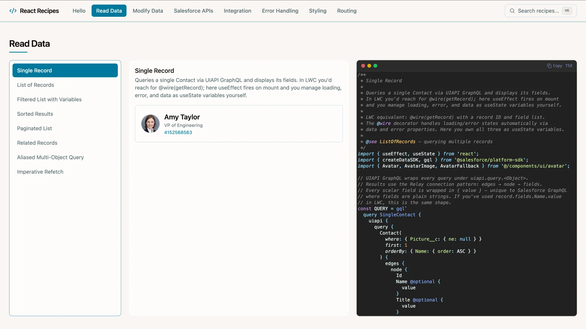
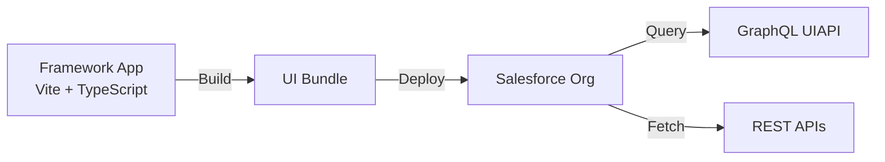

# React Recipes



A Salesforce UI Bundle demonstrating how to build a React app that runs directly on the Salesforce platform. The bundle is built with Vite + TypeScript and deployed to the org as a single artifact; Salesforce serves the static assets.



**Use when:** you want a single-team workflow, zero external infrastructure, and deep integration with Salesforce's security/identity model.

> Check the [prerequisites](../../../README.md#prerequisites) in the root README before starting.

## Install & Deploy

Unless noted, run these commands from the repository root.

1. Install dependencies:

   ```bash
   npm run install:all
   ```

1. Fetch the GraphQL schema and run codegen (regenerates the typed operations under `src/api/`):

   ```bash
   cd force-app/main/react-recipes/uiBundles/reactRecipes
   npm run graphql:schema
   npm run graphql:codegen
   cd ../../../../..
   ```

1. Build the app:

   ```bash
   npm run build
   ```

1. Deploy metadata and the UI bundle:

   ```bash
   sf project deploy start --source-dir force-app
   ```

1. Assign the **recipes** permission set to the default user:

   ```bash
   sf org assign permset -n recipes
   ```

1. Import sample data:

   ```bash
   sf data tree import -p ./data/data-plan.json
   ```

1. Open the org and select the **React Recipes** app in App Launcher:

   ```bash
   sf org open
   ```

## Local Development

Start the development server with hot reload:

```bash
npm run dev
```

Build the app for production:

```bash
npm run build
```

## Testing

Run unit tests ([Vitest](https://vitest.dev/) + [React Testing Library](https://testing-library.com/docs/react-testing-library/intro/)):

```bash
npm run test:react
```

Run with coverage:

```bash
npm run test:coverage:react
```

Run end-to-end tests ([Playwright](https://playwright.dev/)):

```bash
cd force-app/main/react-recipes/uiBundles/reactRecipes
npx playwright install chromium
npm run build:e2e
npm run test:e2e
```
