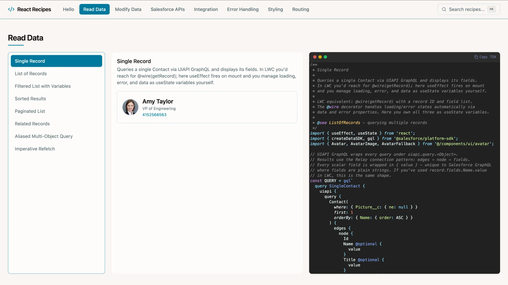

# React Recipes



A Salesforce UI Bundle demonstrating how to build a React app that runs directly on the Salesforce platform. The bundle is built with Vite + TypeScript and deployed to the org as a single artifact; Salesforce serves the static assets.

**Use when:** you want a single-team workflow, zero external infrastructure, and deep integration with Salesforce's security/identity model.

> To install and deploy, follow [Setting up a Scratch Org](../../../README.md#setting-up-a-scratch-org) in the root README — it deploys every recipe app together. Unless noted, run the commands below from the repository root.

## Local Development

Start the development server with hot reload:

```bash
npm run dev:react
```

Build the app for production:

```bash
npm run build
```

The generated GraphQL types under `src/api/` are committed. If you change a query, regenerate them against your org:

```bash
cd force-app/main/react-recipes/uiBundles/reactRecipes
npm run graphql:schema
npm run graphql:codegen
```

## Testing

Run unit tests ([Vitest](https://vitest.dev/) + [React Testing Library](https://testing-library.com/docs/react-testing-library/intro/)):

```bash
npm run test:react
```

Run with coverage:

```bash
npm run test:coverage:react
```

Run end-to-end tests ([Playwright](https://playwright.dev/)):

```bash
cd force-app/main/react-recipes/uiBundles/reactRecipes
npx playwright install chromium
npm run build:e2e
npm run test:e2e
```
